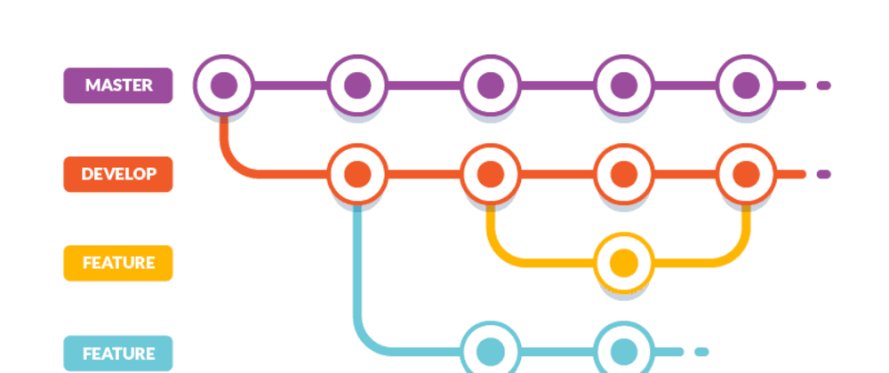
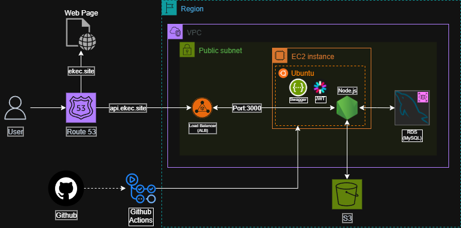

## UMC EKEC Backend

## 📄 Description


**이크에크(EKEC)는 개인의 성향에 꼭 맞는 모임을 찾아주는 매칭 플랫폼 입니다.**
<br>
성향 맞춤 필터링으로 나와 잘 맞는 모임을 찾을 수 있고, <br>리뷰 시스템과 활발한 활동 공유를 통해 모임의 분위기를 미리 파악하여 참여할 수 있는 커뮤니티 서비스 입니다.

<**본 레포지토리는 이크에크 서비스의 백엔드 서버로, Node.js 기반으로 핵심 비즈니스 로직과 RESTful API를 제공합니다.**>

## 👨‍💻 Developers

|  |  |  |  |  |
| :------------------------------------------------------------------------: | :-------------------------------------------------------------------------: | :-------------------------------------------------------------------------: | :------------------------------------------------------------------------: | :-------------------------------------------------------------------------: |
|                   [이호현](https://github.com/hoshi2710)                   |                  [금시언](https://github.com/silversieon)                   |                    [주현준](https://github.com/bikooju)                     |                   [염수림](https://github.com/rimit-rim)                   |                   [김태현](https://github.com/xogus-git)                    |

## 📁 Project Structure

```
EKEC
├── assets/              # 이미지, 폰트 등 정적 파일 보관
├── prisma/              # Prisma 관련 파일
│   └── schema.prisma    # 데이터베이스 모델 스키마 정의
├── src/                 # ✨ 메인 소스 코드
│   ├── alarm/           # 알림 관련 기능
│   ├── auth/            # 👤 사용자 인증 및 인가 (로그인, 소셜로그인, JWT)
│   ├── config/          # ⚙️ 프로젝트 설정 (AWS, OAuth, Scheduler 등)
│   ├── crew/            # ⛵ 크루(모임) 관련 기능
│   │   ├── apply/         # 지원 관리
│   │   ├── creation/      # 생성 관리
│   │   ├── list/          # 목록 조회
│   │   ├── page/          # 크루 페이지 (공지, 게시글, 앨범 등)
│   │   │   └── notice/      # 📢 공지사항 (대표 아키텍처 예시)
│   │   │       ├── controller/  # HTTP 요청/응답 처리
│   │   │       ├── service/     # 비즈니스 로직
│   │   │       ├── repository/  # 데이터베이스 접근
│   │   │       ├── route/       # 라우팅 설정
│   │   │       └── dto/         # 데이터 전송 객체 (Request/Response)
│   │   └── search/        # 검색
│   ├── image/           # 🖼️ 이미지 업로드 처리
│   ├── route/           # ↔️ Express 메인 라우터
│   └── utils/           # 🛠️ 공통 유틸리티 함수
│
├── .env                 # 환경 변수 파일
└── package.json         # 프로젝트 정보 및 의존성 관리
```

## 🌿 Branch Strategy



- **Main** : 완료된 버전
- **Develop** : 개발 중인 버전
- **Feature** : 각 기능별 브랜치 **(feature/{nickname}/{feature_name})**

## 📚 Tech Stack

- Node.js
- Express.js
- MySQL
- Prisma ORM
- JWT
- Swagger

## 🎯 Git Convention

🎉 **Start**: 새로운 프로젝트 시작 `[:tada:]`

✨ **Feat**: 새로운 기능을 추가 `[:sparkles:]`

🐛 **Fix**: 버그 수정 `[:bug:]`

🎨 **Design**: CSS 등 사용자 UI 디자인 변경 `[:art:]`

♻️ **Refactor**: 코드 리팩토링 `[:recycle:]`

🔧 **Settings**: 설정 파일 수정 `[:wrench:]`

🗃️ **Comment**: 필요한 주석 추가 및 변경 `[:card_file_box:]`

➕ **Dependency/Plugin**: 의존성 / 플러그인 추가 `[:heavy_plus_sign:]`

📝 **Docs**: 문서 수정 `[:memo:]`

🔀 **Merge**: 브랜치 머지 `[:twisted_rightwards_arrows:]`

🚀 **Deploy**: 코드 배포 `[:rocket:]`

🚚 **Rename**: 파일 혹은 폴더명을 수정하거나 옮기는 작업만인 경우 `[:truck:]`

🔥 **Remove**: 파일을 삭제하는 작업만 수행한 경우 `[:fire:]`

⏪️ **Revert**: 전 버전으로 롤백 `[:rewind:]`

## 🏗️ Server Architecture


